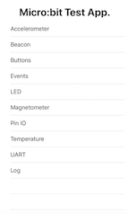
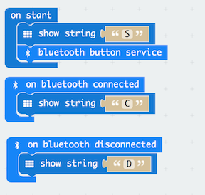
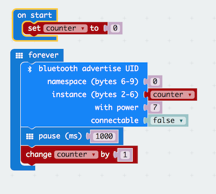

# Overview
The micro:bit is a great bit of kit for hobbyists, designers, educators and of course students.

- It’s cheap. For under £13, you get a very versatile micro computer and, while I don’t condone cruelty to electronic components,  if the worst happens it won’t break the bank to replace. For many in 2016 it was even cheaper, well free, when the BBC gave one to a million school children.
- It’s been well designed. Based on the Nordic nRF51822 micro processor, the credit card size micro computer can be easily integrated into electronic projects taking ideas to fully working models. 
- It’s simple to program. Using the JavaScript Blocks Editor programs can be created and transferred to the micro:bit without complicated development environments.
- It implements Bluetooth Low Energy (BLE). It provides an easy way of introducing BLE into projects and facilitating communication with devices like smart phones and tablets.
- It’s open source. With the hardware licensed under Solderpad  and the runtime software under MIT, designers are free to develop products based on the micro:bit design.

Of course there is a plethora of devices that can do similar things to the micro:bit.  Some are specific and promote particular features of chip manufactures while others like Arduino and Raspberry pi are general purpose but may require greater complexity and expense to achieve a requirement easy served  by the micro:bit.

One of the strengths of the micro:bit is it's implementation of BLE. Martin Woolley, the principal architect for the micro:bit bluetooth implementation, has produced some very interesting articles: 

- [Bluetooth and the micro:bit](http://blog.bluetooth.com/bbc-microbit-inspiring-generation-get-creative-coding)
- [Designing the Profile for the micro:bit](http://blog.bluetooth.com/bluetooth-bbc-microbit)
- [Developing Applications For The BBC Microbit](http://blog.bluetooth.com/developing-applications-bbc-microbit) 

Martin has written a number of applications for the Android Operating system that demonstrate how the micro:bit can be controlled using a smart phone. There are, however, few examples, at the time of writing, on developing applications for Apple devices such as iPhones and iPads. Apart from the fact there are lots of iPhones and iPads waiting to control micro:bits, there are a few other reasons for writing code for iOS devices: 

- IOS devices do not lend themselves to be hard-wired to external hardware via a USB connection. Apple view this type of interface as an external accessory which would have to be licensed under the Apple MFi program. This is hardly appropriate for ad hoc experimentation.  This is where BLE comes in. Apple does a good job supporting Bluetooth through it’s Core Bluetooth API and the micro:bit does an equally good job implementing  the bluetooth stack which allows  iPads and iPhones to communicate with the micro:bit wirelessly. What’s more,  Core Bluetooth is also supported on macOS,  tvOS and watchOS, meaning your micro:bit can communicate with even more device you might own.
- A few years ago, writing code to run on your own iPad or iPhone would have meant you signing-up for the apple developer program, but now if apps are only for devices you own all you need is an Apple ID which, if you are an apple user, you probably already have (if you want to distribute your code through the App store , you still need to join the developer program ,currently $99 a year). This means if you own an iPad, iPhone, iPod, mac, apple TV or apple watch you can write an app to communicate with your micro:bit project.
- If writing apps all seems a bit over the top (all you want is to try out  an idea), then, since 2016 there is another way of controlling a micro:bit from an iPad. It’s called Swift Playgrounds and it’s a free app from apple. It’s primary purpose is to teach coding, specifically  using the Swift programming language. This done via an electronic publication known as a ‘playground book’. Students can download these playgrounds on different coding topics and interact with them in a fun way to learn computer programming. You can also use Swift Playgrounds to write code from scratch, perhaps to try some thing out, like controlling your micro:bit.

This project describes an Application Programming Interface (API), that can be used to develop applications for Apple operating systems, that interact with the micro:bit.

The API is written in the Swift programming language and exploits the Apple Core Bluetooth framework. It's easily installed in any Xcode project by simply copying [Microbit.swift](https://github.com/phwallen/microbit-swift/blob/master/Microbit/Microbit/Microbit.swift) into an Xcode project.

For further information about Microbit.swift see: **Appendix A - Microbit API**

# The Microbit Playground

To demonstrate the API there is a [micro:bit Swift Playground](https://github.com/phwallen/microbit-swift/blob/master/Microbit.playground.zip).

Usually when developing applications, you would use Xcode's powerful user interface building facilities, however, these are not available to Playgrounds so it is necessary to build user interfaces programmatically. The Micro:bit Playground includes the necessary view controllers and custom views to interact with the micro:bit API.

The view controllers are contained in a single file: [MicrobitUIController](https://github.com/phwallen/microbit-swift/blob/master/Microbit/Microbit/MicrobitUIController.swift) and the custom views are in the file: [MicrobitUI.swift](https://github.com/phwallen/microbit-swift/blob/master/Microbit/Microbit/MicrobitUI.swift). 	  

## Getting Started
 
To use the micro:bit Swift Playground you need to do a few things:

- Download the micro:bit playground.
- Program the micro:bit.
- Edit the micro:bit playground.
- Test that iPad and micro:bit are talking to each other.
### Download the micro:bit playground.

The micro:bit playground has been designed to run on any iPad that has [Swift Playgrounds](https://www.apple.com/uk/swift/playgrounds/) installed. You can install Swift Playgrounds for free by downloading it from the App Store.

Download [Microbit.playground](https://github.com/phwallen/microbit-swift) on an iPad that supports Swift Playgrounds. Tap on: **Microbit.playground.zip** to open, and, tap the **Download** button.

The Microbit.playground will be downloaded to the iPad. Providing Swift playgrounds is installed, you will see and option to **Open in "Playgrounds"**.

Open the **Microbit** playground from the MyPlaygrounds screen. Test it works by tapping **Run My Code** at the bottom of the screen. You should see a screen that looks a bit like this:



Select the **Log** option and check for the message "Bluetooth is available". If you don't see this message, check that Bluetooth is turned on in settings. 

### Program the micro:bit

You will need to  write a simple program to test the playground, if you are new to using the micro:bit read: [Using micro:bit in 5 easy steps](http://microbit.org/guide/quick/). The easiest way to write a program is with the online [Javascript Blocks Editor](https://makecode.microbit.org).

By default the editor does not include the Bluetooth package, so you you will need to add it using the **Add Package** option in the Advanced section of the packages list. For further information on how this is done [see this article](https://support.microbit.org/support/solutions/articles/19000062330-using-the-micro-bit-bluetooth-low-energy-uart-serial-over-bluetooth-).

As a test, write a program that implements the Bluetooth Button Service. Arrange the blocks as shown in the following:
  
To implement the button service, simply add the **bluetooth button service** block to the **on start** block. Also. add some code to indicate the 'state' of the program - 'S' program has started, 'C' program is connected to the iPad, 'D' the program has disconnected from the iPad.

There is one more thing to do before downloading the program to the micro:bit. The pairing option determines how the micro:bit will pair with the iPad. For details about the various pairing option see the section on **Pairing**. For performing this test, turn off pairing. Select the cog in the top right of the editor and then select **Project Settings**. Now select - **No Pairing Required: Anyone can connect via Bluetooth.**

You can now download the program to the micro:bit.

### Edit the micro:bit playground

The micro:bit playground as supplied is very simple. It:

- initialises a MicrobitUIController
- initialises the MicrobitUIController.microbit property using the Microbit class.
- passes the view controller to playground support for display.
 
The Microbit initialiser requires a parameter which is the name the micro:bit advertises. Currently this is in the form of **BBC micro:bit [identifier]**. The identifier will vary between micro:bits. One way to find out the name of your micro:bit is to:

- run the micro:bit playground.
- select the **Log** option.
- press the **Start Scan** button.
- look for a log message that says **Possible device detected:**.
- press the **Stop Scan** button.

Providing the micro:bit is running a bluetooth program you should see the device name e.g.  
**BBC micro:bit [tizip]**. You can now edit the playground to set the correct name e.g.
```
vc.microbit = Microbit("BBC micro:bit [tizip]")
```
### Test the button service

- power the micro:bit and check that it displays **S**
- run the micro:bit playground.
- select the **Buttons** option.
- press the **Start Scan** button.

The log at the bottom of the playground screen should show a number of messages, including messages that Button state characteristics have been found and the serial number and firmware revision. Also the micro:bit should show a **C** on the led matrix.

You can now try pressing the A button on the micro:bit and see if the indicator on the playground changes from black to red. Release the button and the indicator should return to black. Now press the button and hold it down for more than 2 seconds. The indicator should change from red to blue. Repeat the process using button B. If that works you have successfully set up your Swift playground to communicate with a micro:bit.

You should be able to disconnect the micro:bit by pressing **Disconnect**. Check that the micro:bit now displays a **D**. Try connecting again by pressing the **Start Scan**. Disconnection and reconnection may cause the micro:bit program to fail particularly if a lot is running on the micro:bit e.g. managing a number of bluetooth services. If the communication has stoped, or, perhaps random LEDs are on, press the reset button on the micro:bit so that it shows **S** and press **Start Scan** to reconnect.

## Pairing

Bluetooth pairing creates a trusted relationship between two devices and allows them to exchange encrypted data. The pairing procedure does add a level of complication that might not be necessary and, unfortunately, each time the micro:bit is reloaded with a program over USB, the pairing procedure must be repeated. Flashing the micro:bit 'over the air' maintains pairing details so avoids repeating the pairing procedure. To flash the micro:bit over the air you need the free micro:bit app available from the Apple app store.

The Javascript Blocks Editor allows you to set one of three types of pairing when compiling a bluetooth program:

- No Pairing Required: Anyone can connect via Bluetooth.
- JustWorks pairing (default): Pairing is automatic once the pairing is initiated.
- Passkey pairing: Pairing requires 6 digit key to pair.

These options are set in the Project Setting menu accessed by pressing the cog icon at the top right of the Javascript Blocks Editor.

For for general information about pairing the micro:bit with devices such as smart phones and tablets see: [Bluetooth Pairing](https://makecode.microbit.org/reference/bluetooth/bluetooth-pairing).

**Note:** The official micro:bit pairing documentation refers to the need for an application such as 'nRF Master Control Panel' to trigger pairing when using an IOS device. This is not necessary if using the Microbit class described in this document. Initialisation of a Microbit object causes the Event Service - client requirements characteristic to be written, forcing the pairing to be triggered.  

The following is specific to pairing the micro:bit playground.

### No Pairing 

This option is ideal for testing, particularly if you need to repeatedly download code to the micro:bit. All you need to do is ensure the the Microbit class initialiser is called with the correct name of the micro:bit. See **Edit the micro:bit playground** above to find out how to find the name of your micro:bit.

### JustWorks pairing

This option is the default if using the Javascript Blocks Editor. It provides security without the need for a passcode, but it does mean the following process must be repeated each time you download code to the micro:bit.
To use 'JustWorks pairing' follow these steps:

- Select the JustWorks option in Project Settings  before downloading your code to the micro:bit.
- Ensure the iPad has ‘forgotten’ the micro:bit - Go to Settings-Bluetooth and check MY DEVICES. If the BBC micro:bit is listed, select the information icon and select “Forget This Device” 
- Call the Microbit class initialiser with the name of the micro:bit the same way as described in the section on 'NO Pairing'.
- Start the pairing process on the micro:bit (hold buttons A and B down while pressing and releasing the reset button). The micro:bit will display a pattern on the LED matrix.
- Run the Micro:bit Playground and press **Start Scan**.
- Reply to the alert on the iPad. The micro:bit will show a ✅ to indicate it has been paired.
- Reset the micro:bit.
- Once the micro:bit has been paired it will use an identifier without the 5 character extension i.e. the characters between the '[]', so remove the extension (including the square brackets) from the the Microbit initialiser call.  
e.g. 
```
vc.microbit = Microbit("BBC micro:bit")
```
- The micro:bit is now paired with the iPad and should connect each time you start a scan.
 
### Passkey Pairing

Passkey pairing requires a 6 digit random passkey, displayed on the micro:bit,  to be entered on the iPad. To use Passkey pairing follow these steps.

- Select the Passkey option in Project Settings before downloading to the micro:bit.
- Ensure the iPad has ‘forgotten’ the micro:bit - Go to Settings-Bluetooth and check MY DEVICES. If the BBC micro:bit is listed, select the information icon and select “Forget This Device”
- Call the Microbit class initialiser with the name of the micro:bit the same way as described in the section on 'NO Pairing'. 
- Start the pairing process on the micro:bit (hold buttons A and B down while pressing and releasing the reset button). The micro:bit will display a pattern on the LED matrix.
- Run the Micro:bit Playground, select the Log option from the menu and press **Start Scan**.
- The micro:bit will show an ⬅︎. Press button A and the micro:bit will scroll a 6 digit passkey that should be entered into the iPad when prompted.
- The micro:bit will show a ✅ to indicate it has been paired
- Reset the micro:bit.
- Once the micro:bit has been paired it will use an identifier without the 5 character extension i.e. the characters between the '[]', so remove the extension (including the square brackets) from the the Microbit initialiser call.  
e.g.
```
vc.microbit = Microbit("BBC micro:bit")
```
- The micro:bit is now paired with the iPad and should connect each time you start a scan.

# Bluetooth Services

The Micro:bit Playground demonstrates the various Services available on the micro:bit.

For further information regarding the Bluetooth Services available to the micro:bit see [The micro:bit GATT profile](https://lancaster-university.github.io/microbit-docs/resources/bluetooth/bluetooth_profile.html)

## Accelerometer

For information on programming the micro:bit to use the accelerometer service see: [accelerometer reference](https://makecode.microbit.org/reference/bluetooth/start-accelerometer-service).

- Start the Micro:bit Playground  and select the **Accelerometer** option.
- Press **Start Scan** to connect to the micro:bit
- Select the frequency accelerometer data is reported e.g. intervals of 640 milliseconds

The micro:bit reports the acceleration (milli g-force) in three directions:

- x:acceleration in left and right direction. Holding the micro:bit edge connector towards you, if the value is 0, the micro:bit is horizontal. Tilting to the left gives a positive value, tilting to the right gives a negative value. 
- y:acceleration in the forward and backward direction. Holding the micro:bit edge connector towards you, if the value is 0, the micro:bit is horizontal. Tilting towards you gives a positive value, tilting away gives a negative value.
- z:acceleration in up and down direction. If the LED matrix is facing upwards gives a negative number. If the LED matrix is facing down gives a positive number. If the value is 0, the micro:bit is vertical.

## Button 

For information on programming the micro:bit to use the button service see: [Button Service](https://makecode.microbit.org/reference/bluetooth/start-button-service). 

- Start the Micro:bit Playground  and select the **Buttons** option.
- Press **Start Scan** to connect to the micro:bit

The indicators change on the Playground depending on which button is pressed and how long it's pressed for.

## Event

Unlike the other micro:bit services, the Event service is enabled by default when you include the Bluetooth package, you do not have to explicitly enable the service . The service extends the micro:bit message bus over Bluetooth ([see the micro:bit runtime](https://lancaster-university.github.io/microbit-docs/concepts/) for further information about the micro:bit message bus).

The service allows the Playground (or any smart phone or tablet of course) to interact with a micro:bit program and the micro:bit to communicate with the Playground. To demonstrate this, the Playground has been setup to respond to a specific set of user defined Event Service IDs (9010, 9011, 9012, 9013, 9014). You are free to define your own Events IDs for your own projects. The Playground also defines the following Events it can raise on the micro:bit message bus:
    
- MES_DEVICE_INFO_ID
- MES_SIGNAL_STRENGTH_ID
- MES_DPAD_CONTROLLER_ID
- MES_BROADCAST_GENERAL_ID

The following micro:bit program demonstrates the Event service as implemented by the Micro:bit Playground:


To demonstrate micro:bit Events:

- Start the Micro:bit Playground and select the **Events** option.
- Press **Start Scan** to connect to the micro:bit.

The micro:bit program counts from -60 raising event 9010 on the micro:bit message bus every second. The Bluetooth Event Service will transmit the event and its corresponding value to the Playground.

If you press button A on the micro:bit, it will raise event 9011 with the current contents of 'value1', if you press button B, event 9011 will be raised with an value of 0.

The Playground allows you to select one of 4 events the will be transmitted to the micro:bit message bus. If you select MES_DPAD_CONTROLLER_ID and enter a number between 0 and 65535 it will displayed on the micro:bit LED matrix.

## LED

For information on programming the micro:bit to use the LED service see: [LED Service](https://makecode.microbit.org/reference/bluetooth/start-led-service).      

- Start the Micro:bit Playground  and select the **LED** option.
- Press **Start Scan** to connect to the micro:bit.

The matrix on the left-hand side of the Playground depicts the micro:bit LED matrix with each dot representing one of the 25 LEDs. If you press one of the dots the corresponding LED should light.

You can also enter up to 20 characters of text which will be scrolled across the LED matrix. The speed of the scroll can be set as:

- Slow (500 millisecond wait between showing each character).
- Normal (100 millisecond wait between showing each character).
- Fast   (10 millisecond wait between showing each character).

## Magnetometer

For information on programming the micro:bit to use the Magnetometer service see: [Magnetometer Service](https://makecode.microbit.org/reference/bluetooth/start-magnetometer-service).

- Start the Micro:bit Playground  and select the **Magnetometer** option.
- Press **Start Scan** to connect to the micro:bit. 

When you connect to the micro:bit for the first time after reloading a program, the micro:bit will request that you calibrate the magnetometer see [calibrate compass](https://makecode.microbit.org/reference/input/calibrate-compass).

The playground reports magnetometer data at specified intervals:

- X is the magnetic field strength in the direction of magnetic north
- Y is the magnetic field strength in the direction of magnetic east i.e. 90 degrees from magnetic north
- Z is the magnetic field strength vertically down

The playground also reports the compass bearing in degrees from North.

## IO Pin

For information on programming the micro:bit to use the IO Pin service see: [IO Pin service](https://makecode.microbit.org/reference/bluetooth/start-io-pin-service).
 
- Start the Micro:bit Playground  and select the **Pin IO** option.
- Press **Start Scan** to connect to the micro:bit.

The Playground User Interface represents I/O pins 0 to 9 on the edge connector of the micro:bit. Each pin can be switched on (3 volts) by pressing the black dot or off (0 volts) by pressing the red dot.

Pins 0 - 3 can be switched to Analogue (A) or Digital (D) by pressing the yellow buttons. In analogue mode the pin voltages can be set by moving the corresponding sliders.

The voltage on the pins can be Written (W) or Read (R) by pressing the grey button. 

## Temperature

For information on programming the micro:bit to use the Temperature service see: [Temperature service](https://makecode.microbit.org/reference/bluetooth/start-temperature-service).

- Start the Micro:bit Playground  and select the **Temperature** option.
- Press **Start Scan** to connect to the micro:bit.
     
The playground reports the temperature of the micro:bit processor in centigrade. The interval the temperature is reported can be adjusted from 100 milliseconds to 1 minute. An indicator flashes to show a temperature reading has been taken. 
## UART

For information on using the UART service see: [UART service](https://makecode.microbit.org/reference/bluetooth/start-uart-service).

The following micro:bit program can be used with the playground to demonstrate the UART service: 


- Start the Micro:bit Playground  and select the **UART** option.
- Press **Start Scan** to connect to the micro:bit.

Press button A on the micro:bit and see the text ('Hello') sent to the playground.

Type some text in the UART input field followed by '$' and press return on the iPad. The text will be transmitted to the micro:bit and scrolled across the LED matrix.

# Beacon

Beacons are not Bluetooth services, they utilise a bluetooth peripherals ability to advertise services. Beacons advertise small amounts of information, allowing devices like smartphones to detect their proximity to the beacon. There are various beacon message formats, which define the way bluetooth advertising packets are used. The micro:bit uses the  
[Eddystone format](https://lancaster-university.github.io/microbit-docs/ble/eddystone/), whereas Apple operating systems use the iBeacon format. 

The full potential of beacon technology is exploited on Apple platforms using the 'Core Location' API which is not supported by the micro:bit, however, it's still possible to demonstrate beacons using the micro:bit playground and Eddystone protocols.

For programming information using Beacons see :
[Advertise URL](https://makecode.microbit.org/reference/bluetooth/advertise-url) and 

[Advertise UID](https://makecode.microbit.org/reference/bluetooth/advertise-uid).

The following micro:bit program broadcasts a UID every second. Each time the UID is broadcast it increments the instance element. This is necessary because, by default, the Apple software amalgamates similar messages, so if the UID remains constant, the playground would not show each broadcast message. 



To demonstrate the program:

- Start the Micro:bit Playground  and select the **Beacon** option.
- Press **Start Scan** to connect to the micro:bit.

The playground will show micro:bit advertisement data and the received signal strength indication (RSSI). The RSSI can be used as a crude indication of the proximity to the micro:bit.

# Appendix A - Microbit API

The Microbit API is contained in the Microbit.swift file which is simply added to an Xcode project. The file contains:

- the **MicrobitDelegate**  protocol
- the **Microbit** class

## MicrobitDelegate Protocol

Classes implementing the Microbit API should conform to the MicrobitDelegate protocol. Dummy implementations of the protocol functions are included in the Microbit.swift file eliminating the need to implement functions that are not required.

The following delegate functions are available:

- logUpdated(_ log:[String]). Called when a log message is added to the microbit log buffer. Parameter:
	- **log**  the log buffer. 
- advertisementData(url:String,namespace:Int64,instance:Int32,RSSI:Int). Called when the bluetooth central manager reads advertisement data from the micro:bit. Parameters:
	- **url** the string specified by the micro:bit advertise url function.
	- **namespace** the integer specified by the micro:bit advertise UID namespace.
	- **instance** the integer specified by the micro:bit advertise UID instance.
	- **RSSI** the received signal strength indication variable of the advertisement.   
- serviceAvailable(service:ServiceName). Called when a micro:bit characteristic is discovered for a given service. Parameter:
	- **service** the name of Service as specified by the ServiceName enum. 
- uartReceived(message:String). Called when the UART TX characteristic is updated. Parameter:
	- **message** the micro:bit uart write string.
- pinGet(pins:[UInt8:UInt8]). Called when one or more micro:bit pins have changed their value. Parameter:
	- **pins** dictionary of pin value pairs.
- buttonPressed(button:String,action:MicrobitButtonType). Called when the state of one of the micro:bit buttons changes. Parameters:
	- **button** button 'A' or 'B'
	- **action** button state as specified by the MicrobitButtonType enum 
- accelerometerData(x:Int16,y:Int16,z:Int16). Called when the accelerometer data characteristic is updated. Parameters:
	- **x** acceleration in the 'x' direction.
	- **y** acceleration in the 'y' direction.
	- **z** acceleration in the 'z' direction.
- magnetometerData(x:Int16,y:Int16,z:Int16). Called when the magnetometer data characteristic is updated. Parameters:
	- **x** magnetic field strength in the direction of magnetic north.
	- **y** magnetic field strength in the direction of magnetic east.
	- **z** magnetic field strength vertically down.
- compass(bearing:Int16). Called when the magnetometer compass bearing characteristic is updated. Parameter:
	- **bearing** compass bearing from north in degrees.
- microbitEvent(type:Int16,value:Int16). Called when a registered event is raised on the micro:bit. Parameter:
	- **type** event ID
	- **value** integer value associated with the event.
- temperature(value:Int16). Called when the temperature is reported. Parameter:
	- **value** temperature in centigrade.

## Microbit Class
The Microbit class forms the entire API. It should be initialised only once. 

### Initialiser 

init(_ deviceName:String)

Parameters:

- **deviceName** Name of the micro:bit being searched for, or, the name of the micro:bit that should be connected.

example:
```
let microbit = Microbit("BBC micro:bit [tizip]")
```
### startScanning
```
func startScanning()
```
### stopScanning
```
func stopScanning()
```
### disconnect
```
func disconnect()
```
### ledText
```
func ledText(message:String,scrollRate:Int16)
```
Parameters:

- **message**: string to be scrolled across the micro:bit LED matrix
- **scrollRate**: wait in milliseconds between showing each character
### ledWrite
```
func ledWrite(matrix:[UInt8])
```
Parameter:

- **matrix**: array of 5 bytes where the first 5 least significant bits represent a row of LEDs
### uartSend
```
func uartSend(message:String)
```
Parameter:

- **message**: string to be sent to the micro:bit
### pinConfigure
```
func pinConfigure(analougePins:[UInt8:Bool])
```
Parameter:

- **analoguePins**:dictionary where keys are pin numbers and values are true if pin is analogue or false if pin is digital. Only pins 0, 1, 2, 3, 4 and 10 can be configured for analogue read or write. If other pins are configured they will be ignored.
```
func pinConfigure(readPins:[UInt8:Bool])
```
Parameter:

- **readPins**:dictionary where keys are pin numbers and values are true if pin is read or false if pin is write. Pins 0 - 18 are valid.
### pinSet
```
func pinSet(pinValues:[UInt8:UInt8])
```
Parameter:

- **pinValues**:dictionary where keys are pin numbers and values represent a variable voltage if pin is configured as analogue, or, 0: (set pin LOW) 1: (set pin HIGH) if pin is configured as digital.
### accelerometer
```
func accelerometer(period:PeriodType)
```
Parameter:

- **period**: interval accelerometer data is reported. Valid PeriodType values are 1,2,5,10,20,80,160,640 milliseconds. 
### magnetometer
```
func magnetometer(period:PeriodType)
```
Parameter:

- **period**: interval magnetometer data is reported. Valid PeriodType values are 1,2,5,10,20,80,160,640 milliseconds.
### temperature
```
func temperature(period:UInt16)
```
Parameter:

- **period**: interval temperature is reported in milliseconds.
### raiseEvent
```
func raiseEvent(event:MicrobitEvent,value:UInt16
```
Parameters:

- **event**: an event that can be handled by the micro:bit.
- **value**: a value associated with the event.
### registerEvents
```
func registerEvents(events:[Int16])
```
Parameter:

- **events**: an array of integers representing the events raised on the micro:bit that will be notified to the connected device. Note: event 9010 is automatically registered when the client requirements characteristic is discovered. This is done to force a pairing request. 

